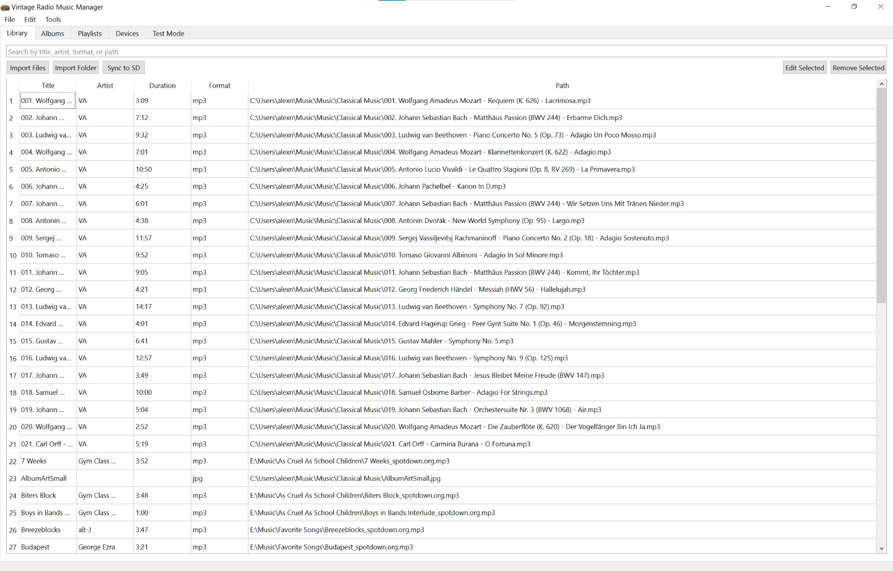
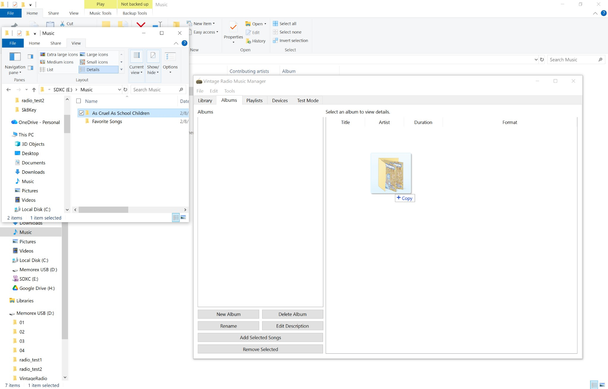
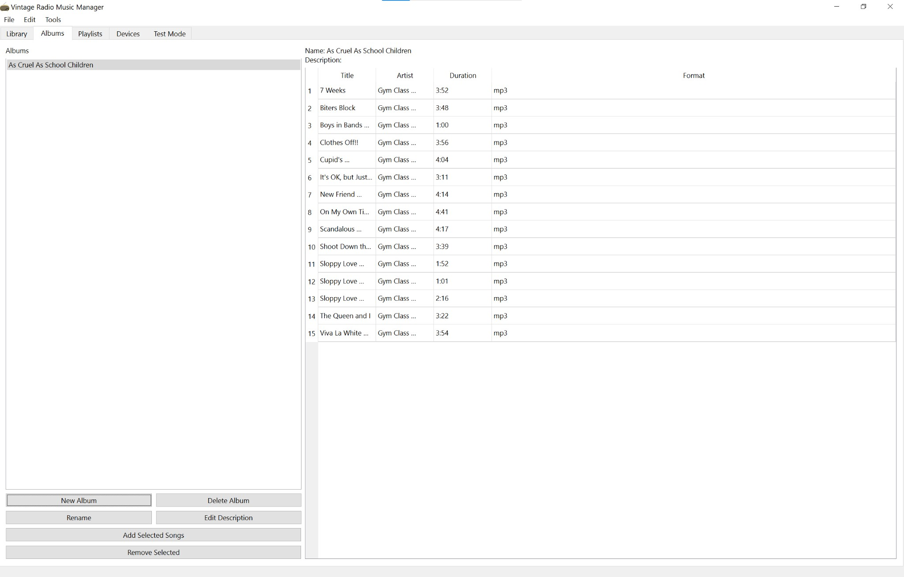
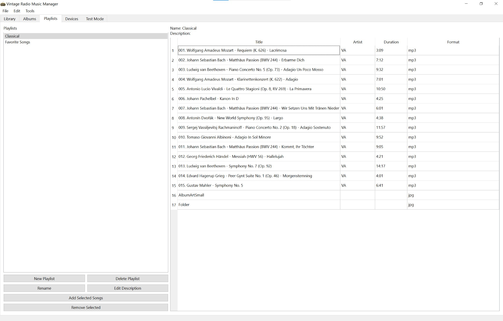
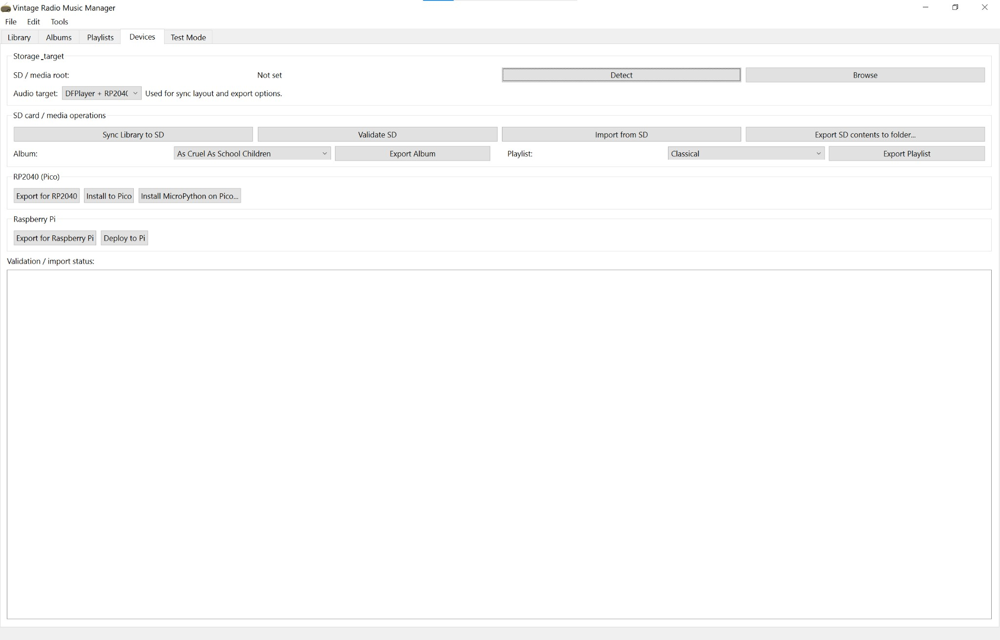
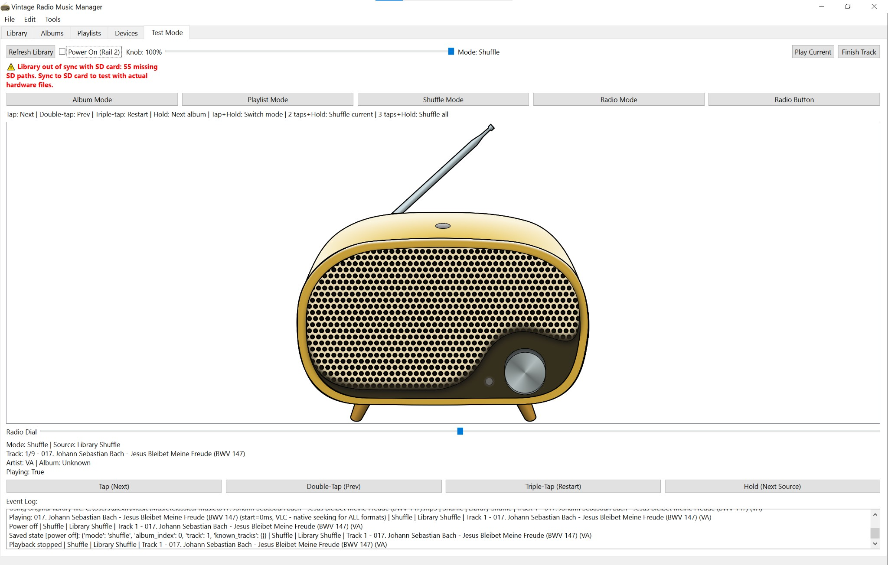
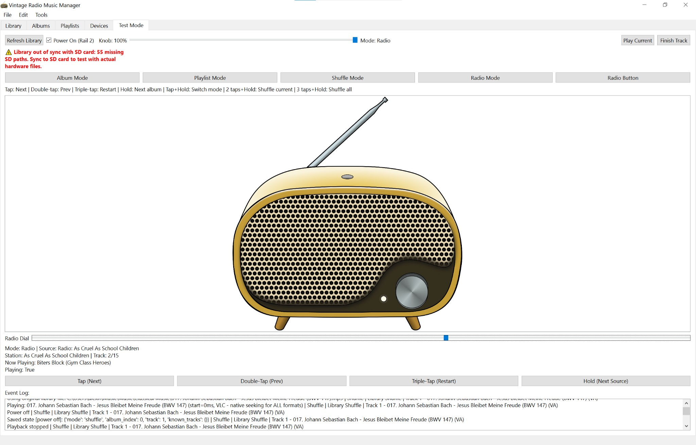

# Vintage Radio Music Manager

This app makes it easier to load and manage music for the [Vintage AM Radio](https://www.zionbrock.com/radio) by Zion Brock—a 3D-printed, offline radio that plays from an SD card and uses a DFPlayer Mini for playback. Instead of manually formatting the card and organizing files by folder and name, you can use this desktop app to manage your library, build albums and playlists, sync to SD with automatic conversion to MP3, and test behavior before using the hardware.

The GUI provides a modern interface for organizing music files, syncing to SD cards, and testing firmware behavior. You can **drag and drop files or folders** into the Library, Albums, or Playlists views to import music quickly.

In the future I will be adding metadata support to automatically create albums from file metadata, and finalize support for the raspberry pi 2 W and raspberry pi 3 (currently implemented, but not fully tested with hardware)

## Features

### Core Functionality
- **Music Library Management**: Import and organize music files in any audio format (MP3, FLAC, WAV, OGG, MIDI, etc.)
- **Album & Playlist Creation**: Create custom albums and playlists with drag-and-drop support
- **Metadata Extraction**: Automatic extraction of title, artist, duration, and format information
- **SD Card Sync**: Sync your library to SD cards with automatic format conversion (to MP3 for hardware compatibility)
- **Test Mode**: Full emulation of the radio device with visual radio face and interactive controls

### Playback Modes
- **Album Mode**: Play tracks in album order
- **Playlist Mode**: Play tracks in playlist order
- **Shuffle Mode**: Shuffle current album/playlist or entire library
- **Radio Mode**: Virtual radio stations with continuous playback and tuning dial

### Advanced Features
- **Format Conversion**: Automatic conversion to MP3 during SD sync for DFPlayer Mini compatibility
- **Virtual Time Tracking**: Radio mode tracks continuous playback across stations
- **AM Radio Overlay**: Authentic AM radio sound effects when tuning or switching modes
- **State Persistence**: Resume playback from where you left off after power cycles
- **Database Backups**: Automatic database backups with configurable retention

## Requirements

### Python
- Python 3.8 or higher

### Dependencies
Install from `requirements.txt`:
```bash
pip install -r requirements.txt
```

**Core Dependencies:**
- `PyQt6>=6.6.0` - GUI framework
- `mutagen>=1.47.0` - Audio metadata extraction
- `pygame>=2.5.2` - Audio playback (test mode)
- `psutil>=5.9.0` - System utilities (SD card detection)
- `pydub>=0.25.1` - Audio processing
- `python-vlc>=3.0.20123` - Advanced audio playback (optional, for better seeking support)

### Required for file conversion (sync to SD)
To convert non-MP3 files (FLAC, WAV, OGG, etc.) to MP3 when syncing to SD card or exporting, **one of the following is required**:

- **VLC Media Player** (recommended) – [Download from VideoLAN](https://www.videolan.org/vlc/). Install on your system; the app will use it for conversion and for better seeking in Test Mode.
- **FFmpeg** – [Download from FFmpeg](https://ffmpeg.org/download.html) and add it to your system PATH. The app uses pydub with FFmpeg as a fallback when VLC is not installed.

Without either VLC or FFmpeg, only MP3 files can be synced (other formats will be skipped).

### Optional
- **VLC** also improves playback and seeking in Test Mode. **FFmpeg** is only used when VLC is not available for conversion.

## Installation

1. Clone the repository:
```bash
git clone <repository-url>
cd Vintage_radio
```

2. Create a virtual environment (recommended):
```bash
python -m venv .venv
.venv\Scripts\activate  # Windows
# or
source .venv/bin/activate  # Linux/Mac
```

3. Install dependencies:
```bash
pip install -r requirements.txt
```

## Usage

### Running the Application

```bash
python -m gui.radio_manager
```

Or directly:
```bash
python gui/radio_manager.py
```

### Basic Workflow

1. **Import Music Files (Library)**
   - **Drag and drop** audio files or entire folders into the Library tab, or use Import Files / Import Folder. The library shows all tracks in a searchable table with title, artist, duration, and format; you can edit or remove entries from here and use **Sync to SD** when ready.
   - 

2. **Create Albums**
   - In the Albums tab, create a new album, then **drag and drop** files or folders onto the drop area (or add selected songs from the library). Select an album to see its track list, reorder by dragging, and use the buttons to rename, edit the description, or remove tracks.
   - 
   - 

3. **Create Playlists**
   - In the Playlists tab, create a playlist and add tracks from the library (or drag and drop). The right panel shows the playlist’s track list; use Add Selected Songs / Remove Selected to adjust the order and contents.
   - 

4. **Sync to SD and Devices**
   - The Devices tab is where you set the **SD / media root** (or drag a folder onto it), run **Sync Library to SD**, validate the card, and export album or playlist contents. You can also export for RP2040 (Pico), install to Pico, or deploy to Raspberry Pi.
   - 

5. **Test Mode**
   - The Test Mode tab emulates the radio: power on/off, volume knob, and mode buttons (Album, Playlist, Shuffle, Radio). Use the virtual dial and tap/hold controls to change tracks and stations; the event log at the bottom shows playback and state. Sync your library to SD first so Test Mode can use the same files as the hardware.
   - 
   - 

### Button Controls (Works on Physical Device and Test Mode - try clicking the button on the test mode radio and using the dial!)

- **Single Tap**: Next track
- **Tap + Hold**: Toggle Album/Playlist mode
- **2 Taps + Hold**: Shuffle current album/playlist
- **3 Taps + Hold**: Shuffle entire library
- **Radio Dial**: Tune between radio stations
- **Volume Knob**: Adjust volume
- **Power Button**: Turn device on/off

## Building standalone executables (Windows / Mac)

To build a standalone folder (no install; user runs the exe or .app directly):

1. Install dependencies and PyInstaller:
   ```bash
   pip install -r requirements.txt
   pip install pyinstaller
   ```

2. From the project root, run:
   ```bash
   pyinstaller vintage_radio.spec
   ```
   Close any running Vintage Radio app (or process using `dist/Vintage Radio`) before rebuilding, or PyInstaller may fail with "Access is denied". Use `--noconfirm` to skip the "Continue? (y/N)" prompt. SyntaxWarnings from the `pydub` dependency during build are harmless; to hide them use `$env:PYTHONWARNINGS='ignore::SyntaxWarning'` (PowerShell) before running PyInstaller.

3. Output is in `dist/Vintage Radio/`. If the exe shows a generic icon in Explorer (especially in list view), try renaming the exe once so Windows refreshes its icon cache. Run the executable inside that folder. All Python dependencies and the radio icon are included. VLC is not bundled; users can install VLC system-wide for better conversion and seeking if desired.

**Windows:** For a proper .exe icon, create an ICO from the PNG (requires Pillow):  
`python -c "from PIL import Image; Image.open('gui/resources/vintage_radio.png').save('gui/resources/vintage_radio.ico', format='ICO', sizes=[(256,256),(48,48),(32,32),(16,16)])"`  
Then rebuild. The spec will use `vintage_radio.ico` if present.

## Project Structure

```
Vintage_radio/
├── .github/
│   └── workflows/
│       └── build-release.yml   # CI: build Windows/macOS executables
├── components/                 # Hardware interfaces
│   ├── __init__.py
│   ├── dfplayer_hardware.py   # DFPlayer (Pico/RP2040)
│   └── pi_hardware.py         # Raspberry Pi (VLC)
├── docs/
│   ├── README_Pi.md           # Raspberry Pi setup
│   └── README_RP2040.md       # RP2040 firmware notes
├── gui/                        # GUI application code
│   ├── __init__.py
│   ├── radio_manager.py       # Main window
│   ├── test_mode.py           # Test mode emulator
│   ├── database.py            # Database operations
│   ├── sd_manager.py          # SD card sync
│   ├── hardware_emulator.py   # Hardware emulation
│   ├── audio_metadata.py      # Metadata extraction
│   ├── resource_paths.py      # Paths for dev vs frozen exe
│   ├── resources/             # Icons, images, sounds
│   │   ├── vintage_radio.ico, .png, .svg
│   │   ├── volDial.png, powerInd.png, AMradioSound.wav, etc.
│   └── ...
├── radio_core.py              # Shared core logic (GUI + firmware)
├── main.py                    # Firmware entry (reference)
├── main_pi.py                 # Raspberry Pi entry
├── run_vintage_radio.py       # Launcher for GUI (used by PyInstaller)
├── vintage_radio.spec         # PyInstaller spec for standalone build
├── requirements.txt
├── README.md
└── RELEASE_NOTES.md           # Template for release notes
```

## Architecture

### Shared Core Logic
The `radio_core.py` module contains the core state machine logic used by both:
- The GUI test mode (emulation)
- The actual firmware (hardware)

This ensures that the test mode accurately represents device behavior.

### Hardware Abstraction
The system uses a `HardwareInterface` abstraction layer:
- **GUI**: `PygameHardwareEmulator` - Uses pygame for audio playback
- **Firmware**: `DFPlayerHardware` - Uses DFPlayer Mini via UART

### Database Schema
- `songs`: Music file metadata
- `albums`: Album definitions
- `playlists`: Playlist definitions
- `album_songs`: Album-track relationships
- `playlist_songs`: Playlist-track relationships
- `sd_mapping`: SD card file mapping
- `settings`: User preferences

## Development

### Testing
The test mode provides a complete emulation of the device:
- Visual radio face with interactive controls
- Full audio playback
- All modes and button combinations
- Detailed logging

### Firmware Integration
The firmware uses `components/dfplayer_hardware.py` (and `components/pi_hardware.py` for Pi), implementing the same `HardwareInterface` as the GUI, ensuring compatibility.

## Known Limitations

- Audio seeking: Some formats (MIDI, etc.) have limited seeking support without VLC
- SD card format: SD cards must be formatted as FAT32 or exFAT
- File size: Large libraries may take time to sync

## Troubleshooting

### Audio Playback Issues
- Ensure pygame is properly installed: `pip install pygame`
- For better format support, install VLC Media Player
- Check that audio files are not corrupted

### SD Card Sync Issues
- Verify SD card is formatted as FAT32 or exFAT
- Check available space on SD card
- Ensure SD card is not write-protected

### Format Conversion Issues
- Install VLC Media Player for best compatibility
- Or install FFmpeg and add to system PATH
- Check that source files are not corrupted

## License

[Add your license here]

## Contributing

[Add contribution guidelines here]

## Acknowledgments

- Built with PyQt6 for the GUI
- Uses pygame for audio playback
- DFPlayer Mini for hardware audio playback


