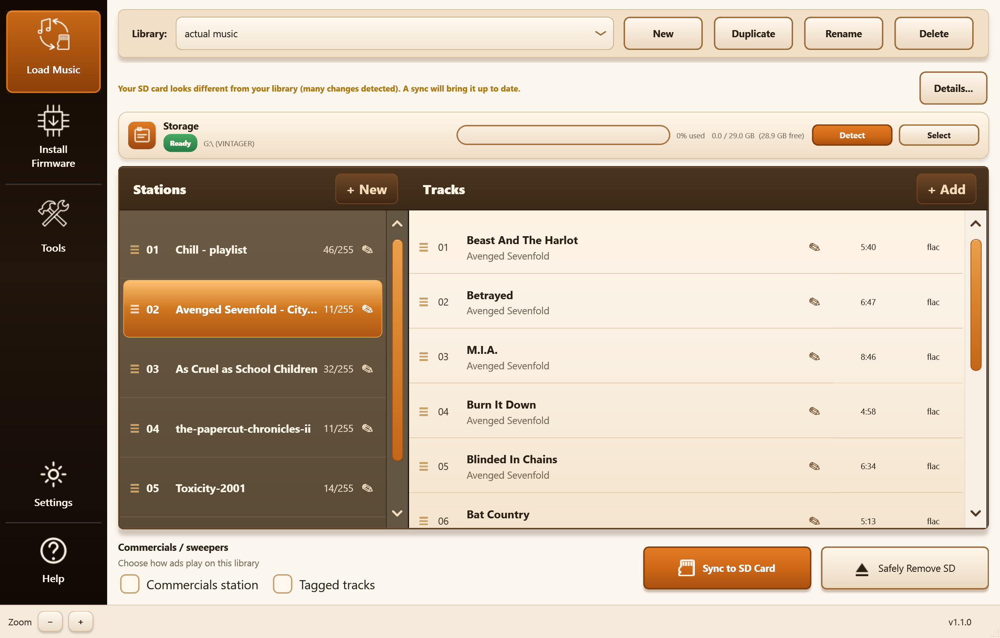
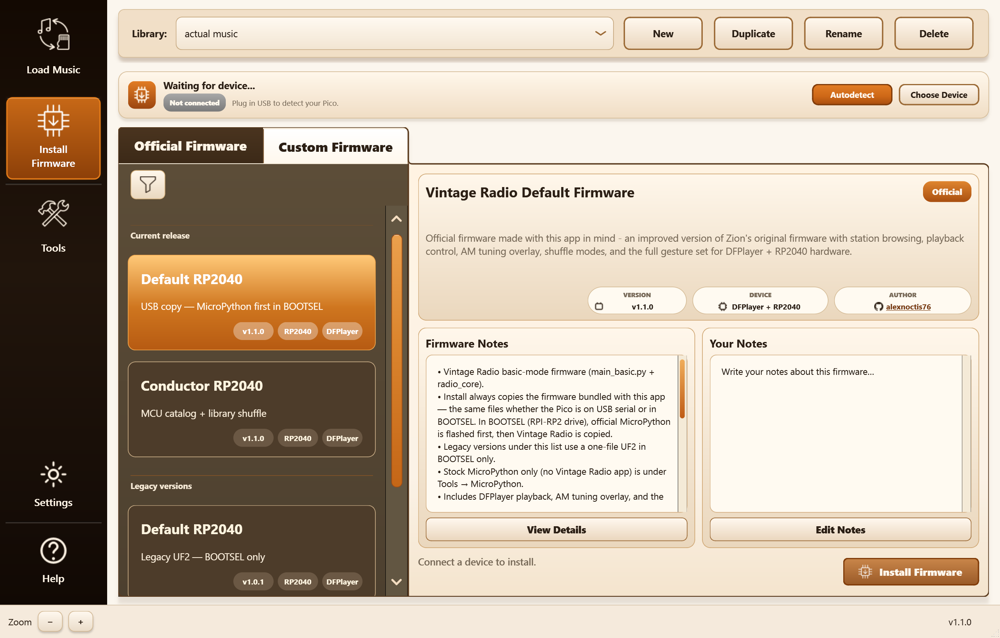
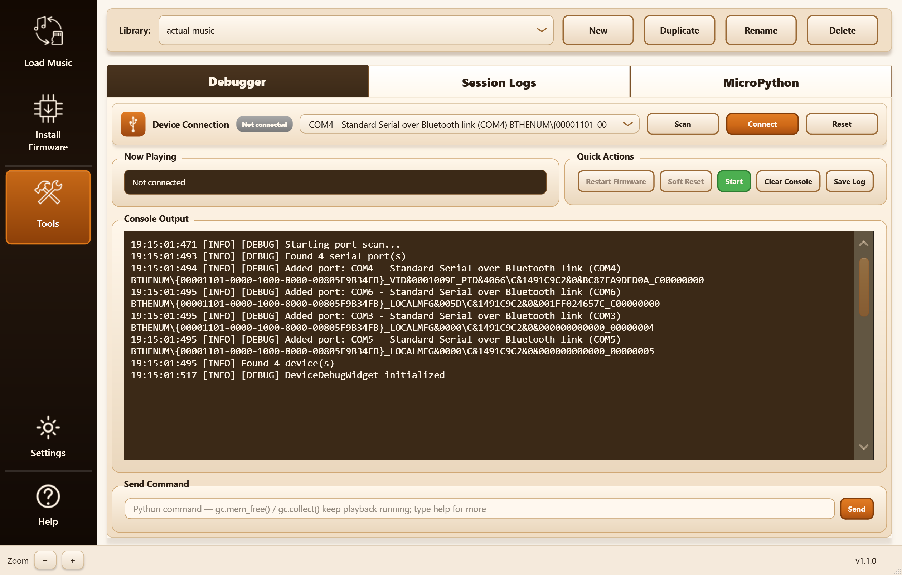
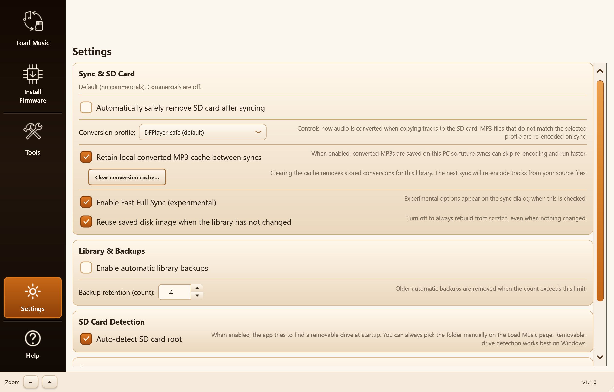
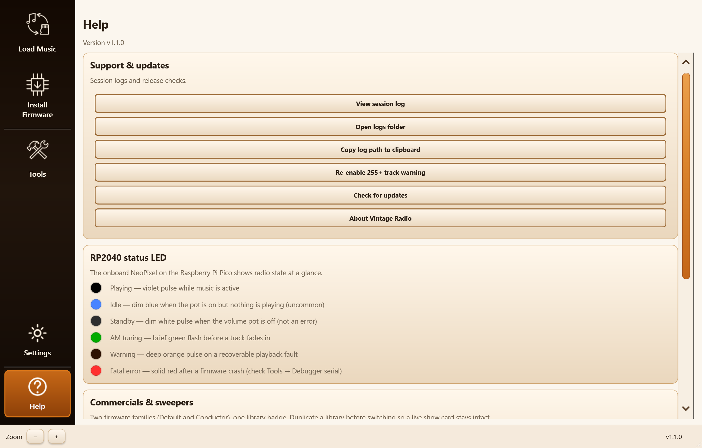

# Vintage Radio

Desktop companion for **Zion Brock’s** [Vintage AM Radio](https://www.zionbrock.com/radio) build (RP2040 + DFPlayer Mini). Import and organize music on your PC, **sync it to the radio’s SD card** with the folder layout the hardware expects, and **install or update firmware** over USB—without hand-renaming hundreds of MP3s or guessing which DFPlayer folder is which.



---

## What this app does


| You do in the app                                      | What happens on the radio                                             |
| ------------------------------------------------------ | --------------------------------------------------------------------- |
| Build a **library** of songs grouped into **stations** | Each station becomes a DFPlayer folder (`01`, `02`, …) on the SD card |
| **Sync to SD**                                         | Files are copied (and converted when needed) into that layout         |
| **Install Firmware**                                   | The RP2040 receives the radio firmware and your library settings      |
| **Tools** (optional)                                   | Connect over USB to view serial output and troubleshoot               |


**Libraries** are separate collections—use one per SD card, per radio, or whenever you want a clean split of content. Use the bar at the top to create, duplicate, rename, or switch libraries.

**Stations** are how the radio groups music: one station becomes one numbered folder on the SD card. If your music is already in folders on disk, drag those folders into the station list.

**Albums and playlists** (under **View → Advanced** in the menu) are extra ways to organize music on the computer. Most people use **stations + sync** for the hardware.

---

## Get the app

Official builds are on [GitHub Releases](https://github.com/alexnoctis76/Vintage_radio/releases).


| Platform                  | Download                         | Run                                                             |
| ------------------------- | -------------------------------- | --------------------------------------------------------------- |
| **Windows**               | `Vintage-Radio-Windows.zip`      | Unzip, open the `Vintage Radio` folder, run `Vintage Radio.exe` |
| **macOS (Apple Silicon)** | `Vintage-Radio-macOS-arm64.zip`  | Unzip, open `Vintage Radio.app`                                 |
| **macOS (Intel)**         | `Vintage-Radio-macOS-x86_64.zip` | Same; use the Intel build on older Macs                         |
| **Linux**                 | *(not in releases yet)*          | See [Linux](#linux) below                                       |


**Updates:** When a newer release is available, the app **prompts you after launch**. You can also check anytime from **Help → Check for updates**.

**MP3 conversion:** Release builds include FFmpeg, so you usually do not need to install VLC or FFmpeg separately for sync.

### macOS first launch

If macOS says the app is “damaged” or won’t open after download:

**In Finder**

1. Open the folder where you unzipped the app.
2. **Control-click** (or right-click) **Vintage Radio.app** → **Open**.
3. In the dialog, click **Open** again. macOS remembers this choice for that app.

If it still refuses to run, clear the download quarantine in Terminal:

```bash
xattr -cr "/path/to/Vintage Radio.app"
```

Then try **Open** again from Finder. Unsigned builds are normal outside the App Store.

### Linux

Linux builds are **not tested yet** by the maintainer. Linux packages will be added to future releases. Until then, you can build locally from source:

```bash
git clone https://github.com/alexnoctis76/Vintage_radio.git
cd Vintage_radio
python3 -m venv .venv
source .venv/bin/activate
pip install -r requirements.txt pyinstaller
bash build/build_linux.sh
```

Run the binary from `dist/Vintage Radio/Vintage Radio` (`chmod +x` if needed). You may need FFmpeg on your PATH when running from source; install steps vary by distro.

---

## Quick start (first SD card + firmware)

### 1. Create or choose a library

Use the library dropdown → **New**, or start with **Default**. Pick a name that sounds like a station lineup (for example **Classic Rock Saturday**, **Late Night Jazz**, or **Garage Oldies**).

### 2. Add stations and tracks

On **Load Music**:

1. Insert the SD card you use in the radio (USB reader on the PC).
2. Click **Detect** or **Select** under **Storage** until the correct drive appears.
3. Under **Stations**, use **+ New** or **drag folders** from File Explorer—one folder per station if you already organize that way.
4. Select a station, then **+ Add** or drag audio files into **Tracks**.

The screenshot above shows a real library: a station (for example **Avenged Sevenfold - City of Evil**) with its track list on the right.

Supported formats include MP3, FLAC, WAV, OGG, and more; non-MP3 formats are converted during sync when conversion is available.



### 3. Sync to SD, then update the RP2040 (both steps)

**Sync to SD Card** copies music into DFPlayer folders on the card. **Install Firmware** copies the matching control program and **library settings** onto the RP2040’s flash (commercials rules, Conductor catalog, EQ profile, and related options).

Treat these as a pair:

1. Click **Sync to SD Card** and wait for it to finish (first sync can take a while). Use **Safely Remove SD** before unplugging the card.
2. With the radio’s RP2040 connected over USB (volume pot **on**), open **Install Firmware** and run install for the **same library** you just synced.

**Run Install Firmware every time you sync the SD card** for that library, so the RP2040 always matches the card and the settings in the app. Skipping install after a sync is a common cause of wrong commercials behavior, missing stations, or Conductor playback that doesn’t match what you see in Load Music.

If your library uses **commercials** or **tagged ad tracks**, enable the options on the sync bar and set how often ads play (for example every **3** music tracks). Details are in [Commercials and optional ads](#commercials-and-optional-ads) below.

### 4. First-time firmware install

1. Connect the RP2040 to the PC with USB (power on; turn the volume pot on for normal boot).
2. Open **Install Firmware**.
3. Choose **Basic** (recommended to start) or **Conductor** if you need the catalog and advanced ad features—see [Firmware options](#firmware-options) below.
4. Follow the on-screen steps. The app copies MicroPython firmware over USB (mpremote). If the board is blank, you may be guided through a one-time **BOOTSEL** step; then run **Install Firmware** again.

Also run **Install Firmware** whenever you change **firmware family**, **commercials mode**, or other library settings that the app says require it—even if you did not sync the SD in that session.

### 5. Listen on the radio

Put the SD card in the radio, power cycle, turn the pot on, and use the physical controls. **Help** explains the status LED colors (for example violet while playing, blue when idle).

---

## Main screens

Navigation is the left sidebar: **Load Music**, **Install Firmware**, **Tools**, **Settings**, **Help**.


| Page                 | Purpose                                                    |
| -------------------- | ---------------------------------------------------------- |
| **Load Music**       | SD storage, stations, tracks, sync                         |
| **Install Firmware** | Install or update Basic / Conductor firmware               |
| **Tools**            | USB serial console and session logs                        |
| **Settings**         | Appearance, sync options, optional SD image sync (Windows) |
| **Help**             | Updates, logs, LED legend, troubleshooting                 |








---

## Firmware options


| Option        | Best for          | Notes                                                                  |
| ------------- | ----------------- | ---------------------------------------------------------------------- |
| **Basic**     | Most radios       | Stations come from folders on the SD card (`01`, `02`, …).             |
| **Conductor** | Advanced layouts  | Catalog on RP2040 flash plus SD audio; inline ads and library shuffle. |
| **Legacy**    | Old projects only | Not recommended for new setups.                                        |

The usual path is **Install Firmware** for **Basic** or **Conductor** (bundled Python copied over USB). **Install Firmware** also covers most MicroPython setup; if the board is empty, you may flash once via **BOOTSEL** as the app directs.

**Other firmware on the RP2040** (optional):

- **Tools → MicroPython** — install official **MicroPython** or other **`.uf2`** images while the board is in **BOOTSEL** mode (the `RPI-RP2` drive appears).
- **View → Advanced** — work with your own Python project or **custom** firmware folders.

You can still use this app to manage **libraries** and **Sync to SD**. Gestures in [Button presses](#button-presses) and the **255-track** limit below apply to **Vintage Radio Basic and Conductor**; other firmware defines its own behavior.

### Why use Vintage Radio firmware (not “SD card only”)?

A DFPlayer module can play files from folders, but **without this project’s RP2040 firmware** you do not get the full radio experience the app is built for:

- **Station-style control** from the front-panel button (next/previous track, change station, shuffle modes)—see [Button presses](#button-presses).
- **Automatic track and station advance** when a song ends.
- **AM-style overlay** and power-on behavior tied to the volume pot.
- **Status LED** feedback on the NeoPixel (playing, idle, warning, and fault states—see **Help**).
- **Commercials** on a schedule (folder 99 and, with Conductor, inline tagged ads).
- **Install Firmware from the app** so settings stay tied to each **library**, not hand-edited scripts on the board.

**Basic** discovers stations from the SD layout the app syncs—simple and predictable.

**Conductor** adds a **catalog** on the RP2040 (written when you **Install Firmware**) so playback order, shuffle, and inline ads follow the library you built in the app, not only raw folder order.

### Keep the RP2040 in sync with your library


| What changed                                     | SD card                         | RP2040 (Install Firmware)                                         |
| ------------------------------------------------ | ------------------------------- | ----------------------------------------------------------------- |
| Added/removed/reordered tracks or stations       | **Sync to SD**                  | **Install Firmware** (same session)                               |
| Commercials mode, interval, or Conductor ad tags | **Sync to SD**                  | **Install Firmware**                                              |
| Switched to a different library in the app       | **Sync to SD** for that library | **Install Firmware** for that library                             |
| App update with new firmware files only          | Optional if music unchanged     | **Install Firmware** when the app prompts or release notes say so |


The SD card holds the **audio files**. The RP2040 holds the **brain** (firmware + catalog/settings). After every **Sync to SD**, run **Install Firmware** so the brain matches the card.

---

## Button presses

All gestures use the **physical button** wired to the RP2040 (one momentary switch). Timing is forgiving, but distinct taps work best. Turn the **volume pot on** so the firmware is awake before testing gestures.

**Tap** = quick press and release. **Hold** = press and keep held until the action triggers, then release.

### Basic firmware


| Gesture                   | Action                                                                |
| ------------------------- | --------------------------------------------------------------------- |
| **Single tap**            | Next track                                                            |
| **Double tap**            | Previous track                                                        |
| **Triple tap**            | Restart current station at track 1                                    |
| **Four taps**             | Previous station                                                      |
| **Five taps**             | First station (returns to ordered station mode)                       |
| **Hold** (no taps first)  | Next station                                                          |
| **Single tap, then hold** | Exit track shuffle → normal ordered playback on the current station   |
| **Double tap, then hold** | Shuffle tracks **within the current station** (repeat to reshuffle)   |
| **Triple tap, then hold** | Jump to **first station** and shuffle tracks there (stays in shuffle) |


Tracks advance automatically when a song ends. In shuffle modes, **single tap** moves through the shuffled order.

### Conductor firmware

Conductor uses the **same taps and holds** as Basic for everyday listening. Differences matter most in shuffle and ads:


| Gesture                   | Conductor behavior                                                                                              |
| ------------------------- | --------------------------------------------------------------------------------------------------------------- |
| **Double tap, then hold** | Shuffle **current station** (music only; **linked** inline commercials stay with the track they’re attached to) |
| **Triple tap, then hold** | Shuffle the **whole library** (music only; unlinked ad tracks are skipped)                                      |


Station changes (**hold**, **four taps**, etc.) follow the **catalog** station list from your library, not a raw DFPlayer folder count.

Inline and folder-99 commercials are configured in the app; **Sync to SD** and **Install Firmware** must both be up to date for them to behave as expected.

---

## Commercials and optional ads

Some libraries include:

- A **commercials station** (folder `99` on the SD) for periodic station IDs or ads between music.
- **Tagged tracks** (Conductor) for short clips tied to specific songs.

Configure these on the **Load Music** sync bar and in library settings, then **Sync to SD** and **Install Firmware** together whenever you update that library.

---

## Other useful features

### View modes (menu bar)

- **View → Advanced** — adds tabs such as the **Emulator** (software preview of radio behavior).
- **View → Legacy** — older album/playlist layout; kept for long-time projects.

### SD disk image (Windows, optional)

In **Settings**, you can turn on **SD image sync** to write a full card image in one step—handy for the *first* load of a very large library (it's faster). Use normal **Sync to SD** for everyday changes.

### Tools tab

Connect the **COM port**, watch serial messages, and open **session logs** when you need to diagnose USB or playback issues (logs are also under **Help**).

---

## Tips and troubleshooting


| Issue                                 | What to try                                                                               |
| ------------------------------------- | ----------------------------------------------------------------------------------------- |
| Sync skips some files                 | Use a release build (bundled FFmpeg) or install FFmpeg for source installs                |
| “Different SD card from last sync”    | Normal when swapping cards; confirm the drive letter before syncing                       |
| Install Firmware can’t see the RP2040 | Replug USB, try another cable/port, close apps using the COM port                         |
| COM port busy                         | Disconnect in **Tools**, close other serial programs                                      |
| macOS won’t open the app              | Finder **Open** workaround or `xattr -cr` (see [macOS first launch](#macos-first-launch)) |
| Too many tracks in one station        | See below                                                                                 |


**255 tracks per station:** The station list shows counts like `11/255`. **Vintage Radio Basic and Conductor do not support more than 255 tracks in one station** (one DFPlayer folder). Split a large album across **two stations** (two folders on the SD card).

If you run **different firmware** (your own MicroPython code, a third-party UF2, or custom files from **View → Advanced**), you may define different limits on the board—the app may show informational warnings above 255, but that is **your** firmware’s responsibility. **Help → Re-enable 255+ track warning** turns that heads-up back on if you dismissed it.

Use **Help → View session log** or **Open logs folder** when you need to share logs for support.

---

## Building from source

To build the app yourself (same steps the maintainer uses for packaging):

```bash
git clone https://github.com/alexnoctis76/Vintage_radio.git
cd Vintage_radio
python -m venv .venv
# Windows:  .venv\Scripts\activate
# macOS/Linux:  source .venv/bin/activate
pip install -r requirements.txt pyinstaller
python run_vintage_radio.py
```

Windows: `build\build_windows.bat` — macOS: `bash build/build_macos.sh` — Linux: `bash build/build_linux.sh`. Details: **[docs/BUILD_AND_PACKAGE.md](docs/BUILD_AND_PACKAGE.md)**.

---

## Credits

Hardware design and radio concept: [Zion Brock](https://www.zionbrock.com/radio).

If anything here doesn’t match your app version, check **Help → About Vintage Radio**.